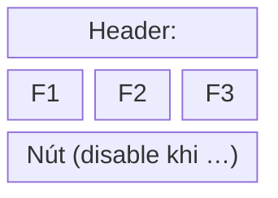
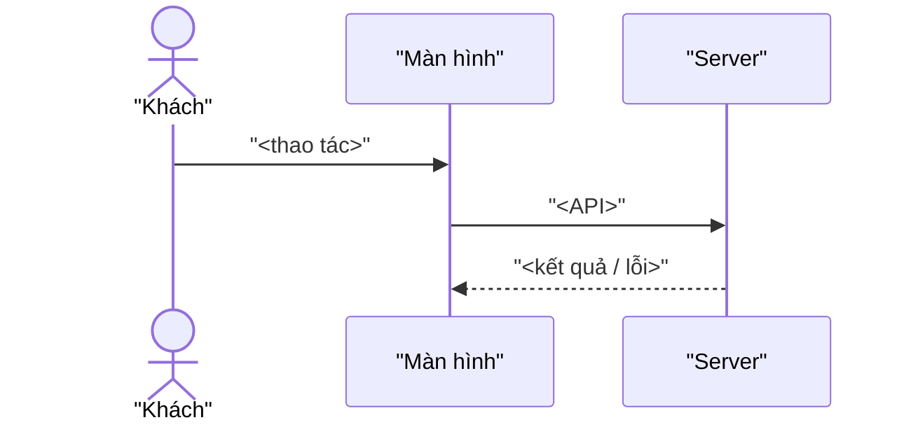
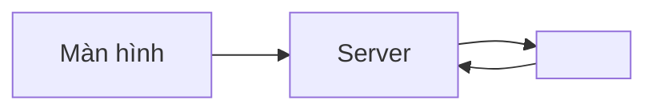

# <Tên hệ thống> — <Tên màn hình / chức năng>

Trạng thái tài liệu: <Bản nộp v1 · ngày>
Quy ước: PHẢI = bắt buộc · KHÔNG ĐƯỢC = cấm · ĐƯỢC PHÉP = tùy chọn. Khoảng thời gian ghi `[bắt đầu, kết thúc)`. Giờ theo <múi giờ>.

## 1. Tổng quan & phạm vi
- Chức năng này làm gì: …
- Actor: …
- TRONG phạm vi: …
- NGOÀI phạm vi (tài liệu này không quy định): …

### 1.1 Thuật ngữ
| Thuật ngữ | Định nghĩa | Trạng thái / giá trị hợp lệ |
|---|---|---|

## 2. Item trên màn hình
Khu vực: <tên khu vực>
| No | 項目名 (Tên item) | コントロール (Control) | I/O | 必須 | Login | Guest | 備考 (Mặc định · giới hạn · format · điều kiện hiển thị/ẩn/disable · text nguyên văn) |
|---|---|---|---|---|---|---|---|

## 3. Event
| No | Event | Trigger | Xử lý (gọi gì, cập nhật gì, mở/đóng gì) | Ghi chú |
|---|---|---|---|---|

## 4. Validation & message lỗi
| No | FE/BE | Item | Nội dung check (có số, toán tử) | Message (nguyên văn) |
|---|---|---|---|---|

## 5. Design / Wireframe

Bố cục: <mô tả 1–2 câu>.
Trạng thái chính: mặc định → … · lỗi → hiện message tại … · thành công → … · rỗng / loading → …

## 6. Flow nghiệp vụ & quy tắc xử lý
### 6.0 Flow end-to-end

<1–2 câu tóm flow>

### 6.x <Tên logic>
Step:
| Step | Ai | Làm gì | Hệ thống phản hồi |
|---|---|---|---|

Case:
| Case | Điều kiện (số · toán tử · múi giờ · mặc định khi config trống) | Kết quả mong đợi (hiển thị · nút · lưu · mail · message) |
|---|---|---|
| Bình thường | | |
| Biên | | |
| Lỗi | | |
Thứ tự ưu tiên khi nhiều case cùng đúng: …
Mọi trường hợp không nêu ở trên → …

### 6.y Trạng thái

<1 câu tóm>. Bảng dưới là luật; sơ đồ chỉ vẽ đường đi hợp lệ.

| Trạng thái \ Sự kiện | <sự kiện 1> | <sự kiện 2> | … |
|---|---|---|---|
(mọi ô điền: trạng thái đích · hoặc "bỏ qua" · hoặc "lỗi E-xx")

## 7. Ràng buộc, ca bất thường liên logic, điều chưa chốt
### 7.1 Ràng buộc & cách giảm nhẹ
| Ràng buộc | Ảnh hưởng | Giảm nhẹ |
|---|---|---|
### 7.2 Ca bất thường cắt ngang nhiều logic
| Ca | Điều kiện | Xử lý |
|---|---|---|
(dữ liệu đổi giữa hiển thị và submit · gửi trùng · mở link hai lần · mail fail sau khi đã lưu)
### 7.3 Lỗi hệ thống chung
| Loại lỗi | Log | Alert | Message cho user (nguyên văn) |
|---|---|---|---|
### 7.4 Điều chưa chốt
| Điểm | Cách xử lý hiện tại |
|---|---|

## 8. Xác thực & phân quyền
| Actor | Xác thực bằng | Làm được | KHÔNG được |
|---|---|---|---|

| Đường truyền | Từ → Đến | Xác thực bằng |
|---|---|---|

## 9. Luồng dữ liệu & API

Hệ thống tham gia: …
| Khi nào | Từ → Đến | Dữ liệu (field · điều kiện gửi) | Thành công | Thất bại (retry · message · log · alert · gửi lại tay) |
|---|---|---|---|---|

| API | Trigger | Payload | Response OK | Response lỗi |
|---|---|---|---|---|

## 10. Data model, performance, security
| Field | Ý nghĩa | Bắt buộc | Giới hạn | Null khi | Server tự tính |
|---|---|---|---|---|---|

| Mục tiêu | Giá trị | Giả định? |
|---|---|---|

| Hạng mục bảo mật | Quy định |
|---|---|
(mã hóa đường truyền · quản lý key · thông tin cá nhân · log & alert)

Tài liệu tham chiếu: …
