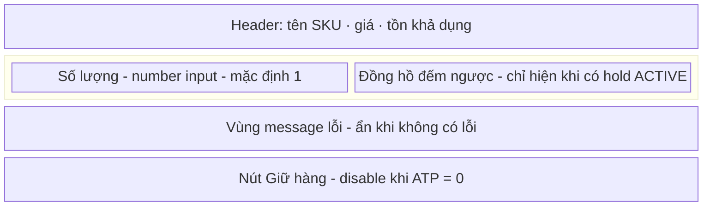
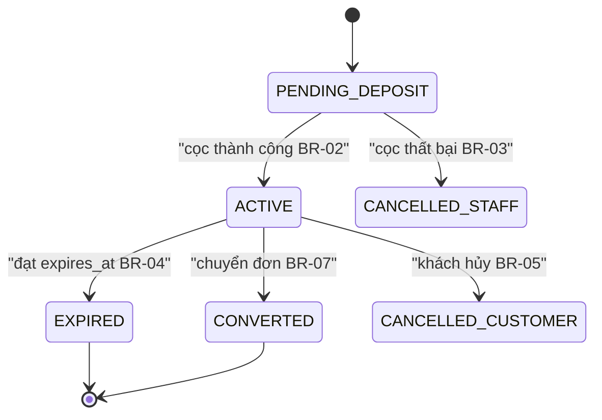
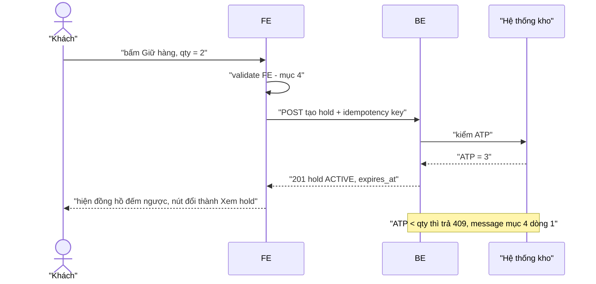
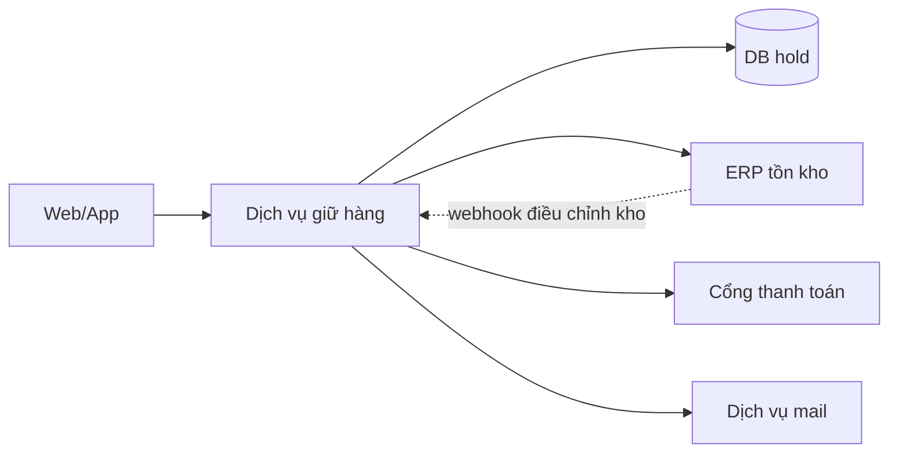

*Tài liệu BTC gửi (11/09) — "Spec Battle Anatomy". Bản trích nguyên văn: `data/btc/spec-battle-anatomy.txt`. Đây là CẤU TRÚC BẮT BUỘC của spec nộp; knowledge/30 là kỹ thuật viết bên trong cấu trúc này.*

# 33 — Cấu trúc spec BTC yêu cầu (10 mục)

## 0. Ba tầng tài liệu

| Tầng | Mục | Góc nhìn |
|---|---|---|
| Basic design 基本設計 | 1–5 | **theo màn hình** |
| Detailed design 詳細設計 | 6–9 | **theo chức năng** |
| Technical spec 技術仕様 | 10 | cho dev |

Hệ quả lớn nhất so với bản cũ: spec KHÔNG còn thuần luật nghiệp vụ trừu tượng — phải mô tả **màn hình, item, event, message lỗi nguyên văn**. Mục 13 checklist knowledge/30 §4 ("WHAT không HOW, không mô tả thao tác UI") **không còn áp dụng cho mục 2–5**; xem §3 file này.

## 1. Mười mục — nội dung & hình thức bắt buộc

| # | Mục | Phải mô tả | Hình thức BTC yêu cầu | Tầng |
|---|---|---|---|---|
| 1 | **Tổng quan & phạm vi** 概要 | Tên hệ thống, tên màn hình / chức năng, trạng thái tài liệu. Chức năng này làm gì. Cái gì TRONG và cái gì NGOÀI phạm vi. | 4–5 dòng bullet | Basic |
| 2 | **Item trên màn hình** 画面項目仕様 | Mọi thành phần người dùng thấy, chia theo khu vực: label, kiểu control (text, dropdown, button, list…), nhập hay chỉ hiển thị, bắt buộc hay không. Mỗi item: giá trị mặc định, giới hạn độ dài / khoảng giá trị, format, placeholder, điều kiện hiển thị / ẩn / disable, **khác biệt login vs guest**, text hiển thị nguyên văn. | Bảng `No · 項目名 · コントロール · I/O · 必須 · 備考` | Basic |
| 3 | **Event** イベント仕様 | Mỗi thao tác gây ra điều gì: mở màn hình lấy dữ liệu gì từ đâu, bấm nút gọi API nào, đổi dropdown cập nhật gì, mở/đóng section nào. | Bảng `No · Event · Trigger · Xử lý · Ghi chú` | Basic |
| 4 | **Validation & message lỗi** バリデーション仕様 | Từng rule kiểm tra input: bắt buộc, format, độ dài, khoảng giá trị, và rule nghiệp vụ (vượt tồn kho, hết hạn, trạng thái không hợp lệ). Rule chạy ở **FE, BE hay cả hai**. **Message lỗi đúng từng chữ.** | Bảng `No · FE/BE · Item · Nội dung check · Message` | Basic |
| 5 | **Design / Wireframe** デザイン | Bố cục màn hình, vị trí item, các trạng thái chính (mặc định, lỗi, thành công). Link Figma hoặc ảnh mockup. | Link hoặc ảnh — **không có Figma thì vẽ bằng Mermaid `block-beta` / `flowchart`** (§7) | Basic |
| 6 | **Flow nghiệp vụ & quy tắc xử lý** ビジネスロジック詳細 | Chia business logic thành **từng đơn vị**: một quy tắc hiển thị, một xử lý submit, một chuyển trạng thái, một mail… Mỗi logic mô tả **ba thứ** (xem §2 dưới). | Mỗi logic một mục con: **bảng step** + **bảng `Case · Điều kiện · Kết quả mong đợi`**. Sequence diagram cho flow end-to-end. | Detailed |
| 7 | **Ràng buộc, ca bất thường liên logic, điều chưa chốt** 制約・イレギュラー・確認中 | Gom chung SAU khi từng logic đã có case riêng. Ràng buộc kỹ thuật / nghiệp vụ + cách giảm nhẹ. Ca bất thường **cắt ngang nhiều logic**: dữ liệu đổi giữa lúc hiển thị và lúc submit, gửi trùng, mở link hai lần, mail fail sau khi đã lưu. Lỗi hệ thống chung: log, alert, message chung. **Điều đang chờ xác nhận kèm giả định hiện tại, gom MỘT bảng riêng, không rải trong bài.** | 3–4 bảng ngắn | Detailed |
| 8 | **Xác thực & phân quyền** 認証・認可 | Từng actor (member, guest, staff, admin) xác thực bằng gì, làm được gì, **không được gì**. Giữa các hệ thống: đường truyền nào xác thực bằng gì. | 2 bảng | Detailed |
| 9 | **Luồng dữ liệu & API** データ連携・API仕様 | Các hệ thống tham gia và quan hệ. Mỗi lần trao đổi: khi nào, từ đâu tới đâu, gửi/nhận dữ liệu gì, field nào chỉ gửi trong điều kiện nào. Mỗi API: trigger, payload, response thành công / thất bại làm gì. Khi tích hợp thất bại: retry, message, log, alert, gửi lại tay. | Sơ đồ hệ thống + bảng timing | Detailed |
| 10 | **Data model, performance, security** 技術仕様 | Field lưu trữ: tên, ý nghĩa, bắt buộc, giới hạn, khi nào null, field do server tự tính. Mục tiêu tốc độ và giới hạn API, **ghi rõ số nào là giả định**. Bảo mật: mã hóa đường truyền, quản lý key và thông tin cá nhân, log và alert. Tài liệu tham chiếu. | 3 bảng + danh sách link | Technical |

## 2. Mục 6 — "ba thứ" của mỗi logic (trọng tâm ăn điểm)

Trích nguyên văn BTC: *"Thiếu case nào thì Executor phải đoán ở đúng chỗ đó."* Đây là chỗ TRÚNG/TRƯỢT được quyết định.

1. **Flow xử lý theo step** — ai làm gì và hệ thống phản hồi gì ở mỗi bước.
2. **Các case cần cover** — case bình thường, **case biên**, **case lỗi**, với:
   - điều kiện có **số**,
   - **toán tử** (`>` hay `≥`),
   - **múi giờ**,
   - **giá trị mặc định khi config trống**,
   - **thứ tự ưu tiên khi nhiều case cùng đúng**.
3. **Kết quả mong đợi của từng case** — hiển thị gì, **nút ở trạng thái nào**, lưu gì, gửi mail gì, message gì.

Năm gạch đầu dòng ở (2) là checklist bắt buộc cho MỌI bảng Case; thiếu một gạch = lỗ hổng đúng loại BTC nêu tên. Bốn chiều kết quả cũ (trạng thái cuối / kho / tiền / thông báo) vẫn dùng, **cộng thêm**: hiển thị gì + trạng thái nút + message.

## 3. Điều chỉnh các quy tắc cũ theo cấu trúc mới

| Quy tắc cũ | Trạng thái |
|---|---|
| knowledge/30 §4 mục 13 "WHAT không HOW; không mô tả thao tác UI" | **Chỉ còn áp dụng cho mục 6–10.** Mục 2–5 BẮT BUỘC mô tả UI: control, placeholder, disable, text nguyên văn. |
| knowledge/30 §4 mục 13 "không TBD" | **Đổi:** điều chưa chốt KHÔNG xóa nữa — đưa vào **bảng riêng mục 7** kèm giả định hiện tại. Vẫn không rải TBD trong bài. |
| knowledge/30 §5 "không mô tả màn hình" (tiết kiệm từ) | **Bỏ** — màn hình là mục 2, 5 bắt buộc. |
| Catch-all §0 (knowledge/30 §2) | **Giữ**, đặt ở đầu mục 1 (dưới bullet phạm vi) hoặc thành mục 1.x. Vẫn là vũ khí phòng thủ mạnh nhất. |
| State machine (bảng state × event) | **Giữ**, đặt trong mục 6 như một "logic" riêng: "chuyển trạng thái hold". |
| Decision table hit policy U (knowledge/31) | **Giữ** — chính là "bảng Case · Điều kiện · Kết quả mong đợi" BTC yêu cầu. knowledge/31 §2 vẫn là cách chứng minh bảng không ô trống. |
| Mã BR-xx / EX-xx + truy vết `← A-xx` | **Giữ** — đánh mã trong mục 6 và 7, giúp mục khác trỏ tới và giúp kháng nghị. |
| Mẫu EARS (knowledge/30 §3.1) | **Giữ** cho cột "Kết quả mong đợi" và bảng step. |

## 4. Ánh xạ template cũ (11 mục) → cấu trúc BTC (10 mục)

| Mục cũ | Đi vào đâu |
|---|---|
| §0 Nguyên tắc giải nghĩa / catch-all | Mục 1 (cuối) |
| §1 Phạm vi | Mục 1 |
| §2 Glossary | Mục 1 (nếu ngắn) hoặc đầu mục 6 |
| §3 Actor & quyền | **Mục 8** |
| §4 Tồn kho & công thức | Mục 6 (một logic: "tính tồn khả dụng") + mục 10 (field) |
| §5 State machine | **Mục 6** (một logic riêng) |
| §6 Luật nghiệp vụ (BR) | **Mục 6** (chia theo từng logic) |
| §7 Luồng chính/phụ | **Mục 6** bảng step + sequence diagram |
| §8 Ngoại lệ & lỗi | **Mục 7** (liên logic) + bảng Case lỗi trong mục 6 (trong một logic) |
| §9 Thông báo | Mục 6 (logic "gửi mail") + cột Message mục 4 |
| §10 Phi chức năng & audit | **Mục 10** |
| — (mới) | **Mục 2** item màn hình, **Mục 3** event, **Mục 4** validation & message, **Mục 5** wireframe, **Mục 9** API |

**Bốn mục hoàn toàn mới phải hỏi AI Khách hàng buổi sáng: 2, 3, 4, 9.** Không hỏi = bốn vùng trống lớn.

## 5. Ngân sách token cho 10 mục

Hạn mức thật là **token, không phải từ**: ≤ 6.000 token, **đích bản nộp 5.400 token** (10% đệm để vá sau các lượt xác nhận) — tham số chốt 09/09, cách đo ở knowledge/00 §A1. 5.400 token ≈ **2.100–2.200 từ tiếng Việt**, tức chặt hơn hạn mức 3.000 từ cũ khoảng một phần tư. Phân bổ dưới đây đã cắt theo tỷ lệ đó; ưu tiên mục 6 vì đó là nơi Executor bị bắn nhiều nhất, mục 5 gần như không tốn gì.

| Mục | Token | ≈ Từ | Ghi chú |
|---|---|---|---|
| 1 Tổng quan & phạm vi (gồm catch-all) | 680 | 270 | bullet + 10 dòng catch-all. Tỷ lệ chắn/token tốt nhất trong spec |
| 2 Item màn hình | 575 | 230 | bảng, dồn item cùng khu vực — dấu `\|` là token thật |
| 3 Event | 300 | 120 | bảng |
| 4 Validation & message | 625 | 250 | message nguyên văn tốn token nhưng bắt buộc |
| 5 Design/Wireframe | 100 | 40 | mô tả bố cục bằng chữ + mermaid `block-beta` (§7.1) |
| 6 Flow & quy tắc xử lý | 1.900 | 760 | **lớn nhất** — mỗi logic: step + bảng Case |
| 7 Ràng buộc, bất thường, chưa chốt | 575 | 230 | 3–4 bảng ngắn |
| 8 Xác thực & phân quyền | 300 | 120 | 2 bảng |
| 9 Luồng dữ liệu & API | 200 | 80 | bảng timing |
| 10 Data model, perf, security | 175 | 70 | 3 bảng gọn |
| **Tổng** | **~5.430** | **~2.170** | cắt theo thứ tự §6 dưới |

**Bản nộp là markdown, không có ảnh** (00 §A): mục 5 dùng mermaid trong văn bản, không dùng link Figma hay ảnh mockup dù BTC nêu hình thức đó.

## 6. Thứ tự cắt khi quá hạn mức

Cắt: **10 → 9 → 5 → 3 → 2**. KHÔNG cắt: **1** (phạm vi + catch-all), **6** (flow & case), **7** (bất thường + chưa chốt), **4** (validation & message), **8** (phân quyền).

Lý do: mục 1, 6, 7 là nơi chống TRÚNG; mục 4 và 8 là hai vùng Executor hay đoán sai nhất (message và quyền guest).

## 7. Mermaid — cú pháp cho bốn loại sơ đồ spec cần

Spec là văn bản nộp cho máy đọc, không có Figma trong phòng thi. Dùng Mermaid: viết bằng chữ nên Executor đọc được, lại render thành hình nếu BTC xem bằng công cụ hỗ trợ. Đặt trong khối ```` ```mermaid ```` .

**Quy tắc chung:** nhãn tiếng Việt có dấu phải bọc trong ngoặc kép — `A["Khách đăng nhập"]`; không dùng ký tự `|`, `(`, `)` trần trong nhãn; mỗi sơ đồ ≤ 15 node (spec 5.400 token không đủ chỗ cho hơn); **luôn kèm 1–2 câu chữ tóm tắt ngay dưới sơ đồ** — nếu BTC render lỗi hoặc Executor đọc thô, phần chữ vẫn tải được nghĩa.

### 7.1 Mục 5 — Wireframe bằng `block-beta`



Ba trạng thái màn hình (mặc định / lỗi / thành công) mô tả bằng bảng ngay dưới, không vẽ ba sơ đồ.

`block-beta` là cú pháp mới, một số trình render cũ không hỗ trợ. An toàn hơn: `flowchart TD` với các node xếp dọc theo thứ tự khu vực từ trên xuống.

### 7.2 Mục 6 — State machine bằng `stateDiagram-v2`



**Sơ đồ KHÔNG thay được bảng state × event.** Sơ đồ chỉ vẽ chuyển hợp lệ; ô "Từ chối 0.5" và "KHL" — phần Executor hay đoán sai nhất — chỉ nằm trong bảng. Vẽ sơ đồ *và* giữ bảng đủ 100% ô; hết chỗ thì **bỏ sơ đồ, giữ bảng**.

### 7.3 Mục 6 — Sequence diagram flow end-to-end



Một sơ đồ cho luồng chính là đủ; nhánh lỗi để trong bảng Case, không vẽ thêm sơ đồ.

### 7.4 Mục 9 — Sơ đồ hệ thống bằng `flowchart LR`



Chi tiết khi nào gọi / gửi gì / thất bại thì làm gì nằm ở **bảng timing**, không nhồi vào sơ đồ.

### 7.5 Ngân sách & thứ tự cắt

Bốn sơ đồ trên tốn khoảng **180–220 từ ≈ 450–550 token**. Chúng nằm trong ngân sách mục 5 (100), 6 (1.900), 9 (200) ở §5 — không xin thêm token.

Khi quá hạn mức token, cắt sơ đồ theo thứ tự **7.1 wireframe → 7.4 sơ đồ hệ thống → 7.3 sequence → 7.2 state machine**, mỗi lần cắt thay bằng 1–2 câu chữ. Bảng đi kèm **không bao giờ bị cắt** — bảng chở luật, sơ đồ chỉ chở trực quan.
