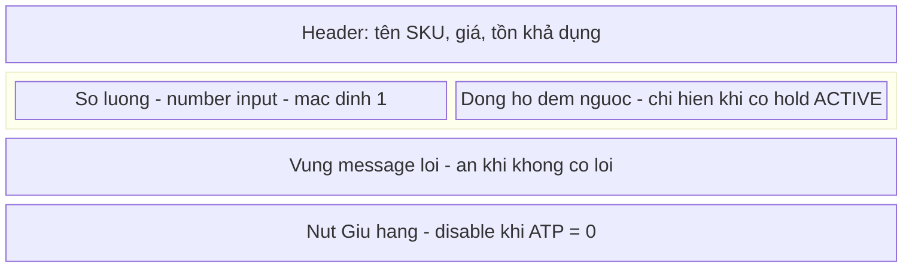
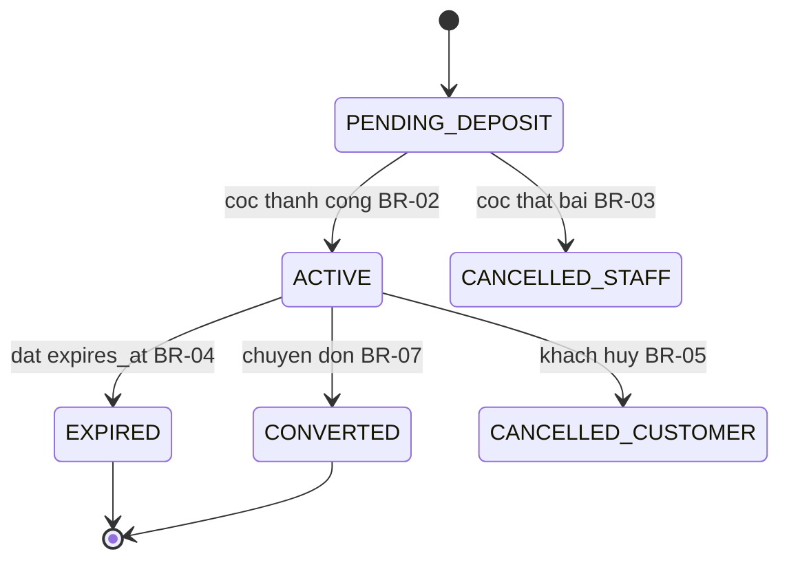
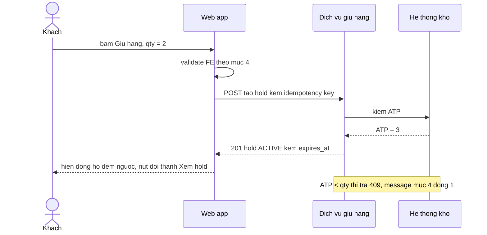
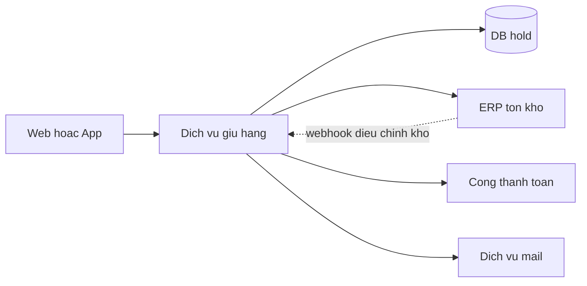
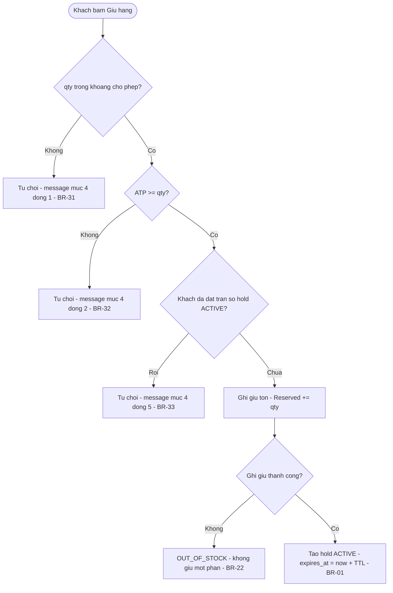
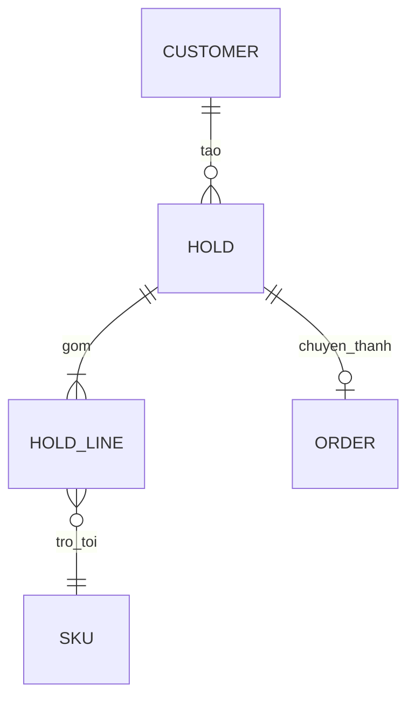

*Tài liệu BTC gửi (11/09) — "Spec Battle Anatomy". Bản trích nguyên văn: `data/btc/spec-battle-anatomy.txt`. Đây là CẤU TRÚC BẮT BUỘC của spec nộp; knowledge/30 là kỹ thuật viết bên trong cấu trúc này.*

# 33 — Cấu trúc spec BTC yêu cầu (10 mục)

## 0. Ba tầng tài liệu

| Tầng | Mục | Góc nhìn |
|---|---|---|
| Basic design 基本設計 | 1–5 | **theo màn hình** |
| Detailed design 詳細設計 | 6–9 | **theo chức năng** |
| Technical spec 技術仕様 | 10 | cho dev |

Hệ quả lớn nhất so với bản cũ: spec KHÔNG còn thuần luật nghiệp vụ trừu tượng — phải mô tả **màn hình, item, event, message lỗi nguyên văn**. Mục 13 checklist knowledge/30 §4 ("WHAT không HOW, không mô tả thao tác UI") **không còn áp dụng cho mục 2–5**; xem §3 file này.

## 1. Mười mục — nội dung & hình thức bắt buộc

| # | Mục | Phải mô tả | Hình thức BTC yêu cầu | Tầng |
|---|---|---|---|---|
| 1 | **Tổng quan & phạm vi** 概要 | Tên hệ thống, tên màn hình / chức năng, trạng thái tài liệu. Chức năng này làm gì. Cái gì TRONG và cái gì NGOÀI phạm vi. | 4–5 dòng bullet | Basic |
| 2 | **Item trên màn hình** 画面項目仕様 | Mọi thành phần người dùng thấy, chia theo khu vực: label, kiểu control (text, dropdown, button, list…), nhập hay chỉ hiển thị, bắt buộc hay không. Mỗi item: giá trị mặc định, giới hạn độ dài / khoảng giá trị, format, placeholder, điều kiện hiển thị / ẩn / disable, **khác biệt login vs guest**, text hiển thị nguyên văn. | Bảng `No · 項目名 · コントロール · I/O · 必須 · 備考` | Basic |
| 3 | **Event** イベント仕様 | Mỗi thao tác gây ra điều gì: mở màn hình lấy dữ liệu gì từ đâu, bấm nút gọi API nào, đổi dropdown cập nhật gì, mở/đóng section nào. | Bảng `No · Event · Trigger · Xử lý · Ghi chú` | Basic |
| 4 | **Validation & message lỗi** バリデーション仕様 | Từng rule kiểm tra input: bắt buộc, format, độ dài, khoảng giá trị, và rule nghiệp vụ (vượt tồn kho, hết hạn, trạng thái không hợp lệ). Rule chạy ở **FE, BE hay cả hai**. **Message lỗi đúng từng chữ.** | Bảng `No · FE/BE · Item · Nội dung check · Message` | Basic |
| 5 | **Design / Wireframe** デザイン | Bố cục màn hình, vị trí item, các trạng thái chính (mặc định, lỗi, thành công). Link Figma hoặc ảnh mockup. | Link hoặc ảnh — **không có Figma thì vẽ bằng Mermaid `block-beta` / `flowchart`** (§7) | Basic |
| 6 | **Flow nghiệp vụ & quy tắc xử lý** ビジネスロジック詳細 | Chia business logic thành **từng đơn vị**: một quy tắc hiển thị, một xử lý submit, một chuyển trạng thái, một mail… Mỗi logic mô tả **ba thứ** (xem §2 dưới). | Mỗi logic một mục con: **bảng step** + **bảng `Case · Điều kiện · Kết quả mong đợi`**. Sequence diagram cho flow end-to-end. | Detailed |
| 7 | **Ràng buộc, ca bất thường liên logic, điều chưa chốt** 制約・イレギュラー・確認中 | Gom chung SAU khi từng logic đã có case riêng. Ràng buộc kỹ thuật / nghiệp vụ + cách giảm nhẹ. Ca bất thường **cắt ngang nhiều logic**: dữ liệu đổi giữa lúc hiển thị và lúc submit, gửi trùng, mở link hai lần, mail fail sau khi đã lưu. Lỗi hệ thống chung: log, alert, message chung. **Điều đang chờ xác nhận kèm giả định hiện tại, gom MỘT bảng riêng, không rải trong bài.** | 3–4 bảng ngắn | Detailed |
| 8 | **Xác thực & phân quyền** 認証・認可 | Từng actor (member, guest, staff, admin) xác thực bằng gì, làm được gì, **không được gì**. Giữa các hệ thống: đường truyền nào xác thực bằng gì. | 2 bảng | Detailed |
| 9 | **Luồng dữ liệu & API** データ連携・API仕様 | Các hệ thống tham gia và quan hệ. Mỗi lần trao đổi: khi nào, từ đâu tới đâu, gửi/nhận dữ liệu gì, field nào chỉ gửi trong điều kiện nào. Mỗi API: trigger, payload, response thành công / thất bại làm gì. Khi tích hợp thất bại: retry, message, log, alert, gửi lại tay. | Sơ đồ hệ thống + bảng timing | Detailed |
| 10 | **Data model, performance, security** 技術仕様 | Field lưu trữ: tên, ý nghĩa, bắt buộc, giới hạn, khi nào null, field do server tự tính. Mục tiêu tốc độ và giới hạn API, **ghi rõ số nào là giả định**. Bảo mật: mã hóa đường truyền, quản lý key và thông tin cá nhân, log và alert. Tài liệu tham chiếu. | 3 bảng + danh sách link | Technical |

## 2. Mục 6 — "ba thứ" của mỗi logic (trọng tâm ăn điểm)

Trích nguyên văn BTC: *"Thiếu case nào thì Executor phải đoán ở đúng chỗ đó."* Đây là chỗ TRÚNG/TRƯỢT được quyết định.

1. **Flow xử lý theo step** — ai làm gì và hệ thống phản hồi gì ở mỗi bước.
2. **Các case cần cover** — case bình thường, **case biên**, **case lỗi**, với:
   - điều kiện có **số**,
   - **toán tử** (`>` hay `≥`),
   - **múi giờ**,
   - **giá trị mặc định khi config trống**,
   - **thứ tự ưu tiên khi nhiều case cùng đúng**.
3. **Kết quả mong đợi của từng case** — hiển thị gì, **nút ở trạng thái nào**, lưu gì, gửi mail gì, message gì.

Năm gạch đầu dòng ở (2) là checklist bắt buộc cho MỌI bảng Case; thiếu một gạch = lỗ hổng đúng loại BTC nêu tên. Bốn chiều kết quả cũ (trạng thái cuối / kho / tiền / thông báo) vẫn dùng, **cộng thêm**: hiển thị gì + trạng thái nút + message.

## 3. Điều chỉnh các quy tắc cũ theo cấu trúc mới

| Quy tắc cũ | Trạng thái |
|---|---|
| knowledge/30 §4 mục 13 "WHAT không HOW; không mô tả thao tác UI" | **Chỉ còn áp dụng cho mục 6–10.** Mục 2–5 BẮT BUỘC mô tả UI: control, placeholder, disable, text nguyên văn. |
| knowledge/30 §4 mục 13 "không TBD" | **Đổi:** điều chưa chốt KHÔNG xóa nữa — đưa vào **bảng riêng mục 7** kèm giả định hiện tại. Vẫn không rải TBD trong bài. |
| knowledge/30 §5 "không mô tả màn hình" (tiết kiệm từ) | **Bỏ** — màn hình là mục 2, 5 bắt buộc. |
| Catch-all §0 (knowledge/30 §2) | **Giữ**, đặt ở đầu mục 1 (dưới bullet phạm vi) hoặc thành mục 1.x. Vẫn là vũ khí phòng thủ mạnh nhất. |
| State machine (bảng state × event) | **Giữ**, đặt trong mục 6 như một "logic" riêng: "chuyển trạng thái hold". |
| Decision table hit policy U (knowledge/31) | **Giữ** — chính là "bảng Case · Điều kiện · Kết quả mong đợi" BTC yêu cầu. knowledge/31 §2 vẫn là cách chứng minh bảng không ô trống. |
| Mã BR-xx / EX-xx + truy vết `← A-xx` | **Giữ** — đánh mã trong mục 6 và 7, giúp mục khác trỏ tới và giúp kháng nghị. |
| Mẫu EARS (knowledge/30 §3.1) | **Giữ** cho cột "Kết quả mong đợi" và bảng step. |

## 4. Ánh xạ template cũ (11 mục) → cấu trúc BTC (10 mục)

| Mục cũ | Đi vào đâu |
|---|---|
| §0 Nguyên tắc giải nghĩa / catch-all | Mục 1 (cuối) |
| §1 Phạm vi | Mục 1 |
| §2 Glossary | Mục 1 (nếu ngắn) hoặc đầu mục 6 |
| §3 Actor & quyền | **Mục 8** |
| §4 Tồn kho & công thức | Mục 6 (một logic: "tính tồn khả dụng") + mục 10 (field) |
| §5 State machine | **Mục 6** (một logic riêng) |
| §6 Luật nghiệp vụ (BR) | **Mục 6** (chia theo từng logic) |
| §7 Luồng chính/phụ | **Mục 6** bảng step + sequence diagram |
| §8 Ngoại lệ & lỗi | **Mục 7** (liên logic) + bảng Case lỗi trong mục 6 (trong một logic) |
| §9 Thông báo | Mục 6 (logic "gửi mail") + cột Message mục 4 |
| §10 Phi chức năng & audit | **Mục 10** |
| — (mới) | **Mục 2** item màn hình, **Mục 3** event, **Mục 4** validation & message, **Mục 5** wireframe, **Mục 9** API |

**Bốn mục hoàn toàn mới phải hỏi AI Khách hàng buổi sáng: 2, 3, 4, 9.** Không hỏi = bốn vùng trống lớn.

## 5. Ngân sách token cho 10 mục — tính theo **%** của hạn mức `L`

Hạn mức `L` **đọc từ brief mỗi đề** (00 §A3), không hardcode. Đích bản nộp `0,90 × L`; sàn "chưa viết xong" `0,75 × L`; cách đo ở 00 §A1.

| Mục | % của `L` | `L`=2.500 | `L`=10.000 | Ghi chú |
|---|---|---|---|---|
| 1 Tổng quan & phạm vi (catch-all 1.x, glossary 1.y) | 9,5% | 240 | 850 | tỷ lệ chắn/token tốt nhất trong spec |
| 2 Item màn hình | 9,5% | 240 | 850 | mọi trần/định dạng ở đây là **giá trị**, phải qua thang §5b |
| 3 Event | 5,5% | 140 | 500 | gồm cả event hệ thống, không chỉ nút bấm |
| 4 Validation & message | 11% | 275 | 1.000 | message nguyên văn **không nén được** và **không có mặc định ngành** |
| 5 Design/Wireframe | 4% | 100 | 350 | mermaid; cắt đầu tiên khi `L` chật |
| 6 Flow & quy tắc xử lý | 35,5% | 890 | 3.200 | lớn nhất ở mọi `L` |
| 7 Ràng buộc, bất thường, chưa chốt | 10% | 250 | 900 | 7.4 (điều chưa chốt) **không cắt** |
| 8 Xác thực & phân quyền | 5% | 125 | 450 | |
| 9 Luồng dữ liệu & API | 6% | 150 | 550 | |
| 10 Data model, perf, security | 4% | 100 | 350 | |
| **Tổng** | **100%** | **2.510** | **9.000** | = đích `0,90 × L`, còn 10% đệm |

**Bản nộp là markdown, không có ảnh** (00 §A): mục 5 dùng mermaid trong văn bản.

Khi `L` chật, bảng này chỉ nói *tỷ lệ*, không nói *phải điền đủ*. Cái quyết định điền gì là thang dưới đây.

## 5b. Thang bằng chứng — thứ tự đổ token, cắt ở đâu hết hạn mức

Đây là bất biến của kit: **thứ tự không đổi theo `L`; `L` chỉ quyết định cắt ở bậc nào.** Đổ từ bậc 1 xuống, hết hạn mức thì dừng — dừng ở bậc 6 là một bản nộp hợp lệ, không phải bản chưa xong.

| Bậc | Nội dung | Vì sao ở bậc này |
|---|---|---|
| 1 | Luật có `A-xx` — nguyên văn lời khách | Bằng chứng trực tiếp; cũng là đạn kháng nghị |
| 2 | Khung 10 mục + catch-all bắt buộc (1.x) | Hình thức BTC chấm; catch-all chắn nhiều test nhất trên mỗi token |
| 3 | **Message nguyên văn** cho mọi nhánh từ chối | Vùng duy nhất **không có mặc định ngành** — im lặng ở đây là Executor bịa chắc chắn |
| 4 | Case biên và case lỗi **phái sinh từ bậc 1** | Không thêm giá trị mới, chỉ trải luật đã có bằng chứng ra các ca ghép |
| 5 | Luật `G-xx` **tra được** mặc định ngành, rủi ro Thấp | Executor mù đoán trùng ⇒ viết ra không xấu hơn im lặng, mà khử được đa nghĩa |
| 6 | Ba sơ đồ BTC yêu cầu tường minh (mục 5, 6, 9) | Điểm hình thức, rẻ |
| 7 | Luật `G-xx` **tra được**, rủi ro Trung | |
| — | **▁▁▁ ĐƯỜNG ĐỎ ▁▁▁** | dưới đây là **giá trị không tra được mặc định ngành** |
| 8 | Luật an toàn hai chiều (32 §3.3) — phát biểu *quan hệ / thứ tự* mà không chốt con số | Đúng ở cả hai phương án; không tạo khẳng định sai |
| 9 | Một con số tự chọn cho ô không tra được | **Chỉ khi** còn hạn mức **và** đã có dòng trong bảng 7.4 **và** đã hết nhịp hỏi |

**Luật đường đỏ:** vượt bậc 8 xuống bậc 9 để "cho spec đầy" là **lỗi Cao**. Lý do là số học, không phải khẩu hiệu (30 §1b-2): một giá trị tự nghĩ ra — khác cả mặc định ngành lẫn specs thật — là ca **duy nhất** tệ hơn im lặng, vì nó biến một TRƯỢT tiềm năng thành TRÚNG gần chắc chắn cho đối thủ.

**Bậc 8 trông như thế nào.** Thay vì chốt một con số không có nguồn, phát biểu cái bất biến:
- ✗ bậc 9: `数量は1〜99の整数` (trần tự nghĩ ra) → ✓ bậc 8: `数量の選択肢は1から上限までの整数のみ。0は選べず、減らす場合は削除ボタンを使う。` (quan hệ + hành vi, không con số)
- ✗ bậc 9: `コードは20文字以内` → ✓ bậc 8: `コード長が規定と異なる場合は適用せず、コード不正のエラーを表示する。`
- ✗ bậc 9: `有効期限は適用時と確定時の両方で判定` (chọn hộ hai mốc) → ✓ bậc 8: `有効期限の判定時点は一つであり、その時点で期限内なら適用を妨げない。`

Bậc 8 mất điểm khi specs thật có con số và đối thủ bắn đúng con số đó — nhưng chỉ mất bằng im lặng, không mất thêm. Bậc 9 sai thì mất chắc.

**Khi còn đệm (chế độ RỘNG, 00 §A3)**, tiêu theo đúng thang này từ bậc đang dừng đi xuống — **không** tiêu vào: viết lại luật cho "mượt", thêm mở bài, giải thích vì sao chọn giá trị, chép lại brief. Ba thứ đó tốn token mà không chắn thêm một test nào.

## 6. Thứ tự cắt khi quá hạn mức

Cắt: **10 → 9 → 5 → 3 → 2**. KHÔNG cắt: **1** (phạm vi + catch-all), **6** (flow & case), **7** (bất thường + chưa chốt), **4** (validation & message), **8** (phân quyền).

Lý do: mục 1, 6, 7 là nơi chống TRÚNG; mục 4 và 8 là hai vùng Executor hay đoán sai nhất (message và quyền guest).

**Cắt hay tiêu — đo chế độ trước, đừng đoán (00 §A3).** Ở chế độ **RỘNG** (`T_A < 0,75 × L`), cắt hiếm khi phải dùng tới và lỗi thường gặp là **dừng sớm**: dưới `0,75 × L` mà thang bằng chứng (§5b) còn bậc chưa đổ là lỗi, không phải tiết kiệm. Ở chế độ **CHẬT** (`T_A ≥ 0,75 × L`), bảng cắt dưới đây mới là thứ dùng tới, và spec ngắn là **đúng** — điền thêm cho đầy bằng giá trị dưới đường đỏ là lỗi Cao.

## 7. Mermaid — sáu loại sơ đồ, cú pháp đã kiểm

Spec là văn bản nộp cho máy đọc, không có Figma trong phòng thi. Dùng Mermaid: viết bằng chữ nên Executor đọc được, lại render thành hình nếu BTC xem bằng công cụ hỗ trợ. Đặt trong khối ```` ```mermaid ```` .

### 7.0 Dùng loại nào ở đâu

| Sơ đồ | Mục | Bắt buộc? | ~Token | Vai trò |
|---|---|---|---|---|
| `block-beta` wireframe (§7.1) | 5 | **BTC yêu cầu hình thức** (link Figma/ảnh → ta thay bằng mermaid) | 180 | bố cục màn hình theo khu vực |
| `stateDiagram-v2` (§7.2) | 6.3 | Nên có | 250 | vòng đời trạng thái — **không thay bảng state × event** |
| `sequenceDiagram` (§7.3) | 6 (cuối) | **BTC yêu cầu tường minh** | 300 | flow end-to-end, nhiều bên tham gia |
| `flowchart LR` sơ đồ hệ thống (§7.4) | 9 | **BTC yêu cầu tường minh** | 200 | ai nói chuyện với ai |
| `flowchart TD` lưu đồ quyết định (§7.5) | 6.x | Nên có cho logic nhiều nhánh nhất | 250 | thứ tự kiểm và mọi nhánh từ chối |
| `erDiagram` (§7.6) | 10 | Tùy chọn | 150 | quan hệ dữ liệu khi không hiển nhiên |

**Quy tắc chung cho mọi sơ đồ:**
- **Luôn kèm 1–2 câu chữ tóm tắt ngay dưới sơ đồ.** Sơ đồ gãy cú pháp thì phần chữ vẫn tải được nghĩa; Executor đọc thô cũng vẫn hiểu.
- Mỗi sơ đồ ≤ 15 node. Nhiều hơn thì tách hai sơ đồ hoặc chuyển phần dư vào bảng.
- **Sơ đồ không bao giờ thay bảng.** Sơ đồ chở trực quan, bảng chở luật có mã. Hết chỗ thì bỏ sơ đồ, giữ bảng.
- Có sơ đồ ⇒ **bắt buộc dòng catch-all 0.15**: "Sơ đồ chỉ minh họa; khi sơ đồ và bảng hoặc luật có mã chỏi nhau, bảng và luật có mã thắng." Thiếu dòng này là tự tạo mâu thuẫn nội tại (loại lỗ hổng #5).
- **Dùng đúng sáu khuôn dưới đây, không sáng tạo cú pháp.** Không có tool render trong phòng thi để thử lại.

### 7.1 Mục 5 — Wireframe bằng `block-beta`



Ba trạng thái màn hình (mặc định / lỗi / thành công) mô tả bằng **bảng ngay dưới**, không vẽ ba sơ đồ:

| Trạng thái | Hiện gì | Nút chính | Message |
|---|---|---|---|
| Mặc định | [..] | [enable] | — |
| Lỗi | [..] | [disable] | mục 4 dòng [..] |
| Thành công | [..] | [đổi text thành "[..]"] | [..] |

`block-beta` là cú pháp mới, một số trình render cũ không hỗ trợ. An toàn hơn: `flowchart TD` với các node xếp dọc theo thứ tự khu vực từ trên xuống.

### 7.2 Mục 6.3 — State machine bằng `stateDiagram-v2`



Nhãn sau dấu `:` **viết trần, không bọc ngoặc kép** — ngoặc sẽ hiện ra trên hình (§7.7 lỗi 2). Muốn tên trạng thái hiển thị có dấu thì khai báo riêng: `state "Đang giữ" as ACTIVE`.

**Sơ đồ KHÔNG thay được bảng state × event.** Sơ đồ chỉ vẽ chuyển hợp lệ; ô "Từ chối 0.5" và "KHL" — phần Executor hay đoán sai nhất — chỉ nằm trong bảng. Vẽ sơ đồ *và* giữ bảng đủ 100% ô.

### 7.3 Mục 6 — Sequence diagram flow end-to-end (BTC yêu cầu)



Tên hiển thị sau `as` và nội dung message sau `:` đều **viết trần**, không ngoặc kép. Mũi tên phải là `->>` (gọi) và `-->>` (trả về) — dùng `-->` của flowchart là lỗi gãy phổ biến nhất (§7.7 lỗi 5).

Một sơ đồ cho luồng chính là đủ; nhánh lỗi để trong bảng Case và trong lưu đồ §7.5.

### 7.4 Mục 9 — Sơ đồ hệ thống bằng `flowchart LR` (BTC yêu cầu)



Chi tiết khi nào gọi / gửi gì / thất bại thì làm gì nằm ở **bảng timing**, không nhồi vào sơ đồ.

### 7.5 Mục 6.x — Lưu đồ quyết định bằng `flowchart TD` (mới, ngân sách 10k mới đủ chỗ)

Dùng cho **logic nhiều nhánh nhất** của spec — thường là "tạo hold" hoặc "áp dụng mã giảm giá". Giá trị riêng của nó: nó bắt lộ **thứ tự kiểm** và **nhánh cụt**. Bảng Case liệt kê các case rời rạc, nên một nhánh không dẫn tới kết quả nào vẫn trông bình thường trong bảng; trên lưu đồ thì thấy ngay.



Thứ tự kiểm trên lưu đồ **là một luật**, không phải minh họa: nó trả lời "nhiều lỗi cùng lúc thì báo lỗi nào" (mục 4, quy tắc 5 gạch "thứ tự ưu tiên khi nhiều case cùng đúng"). Vẽ lưu đồ mà thứ tự khác với bảng Case = mâu thuẫn nội tại, loại lỗ hổng #5.

Ba việc lưu đồ này làm được mà bảng không làm:
- **Nhánh cụt**: mọi mũi tên phải kết thúc ở một node kết quả. Node điều kiện chỉ có một nhánh ⇒ thiếu case.
- **Thứ tự kiểm FE trước hay BE trước** — nối được với cột FE/BE của mục 4.
- **Điểm ghi dữ liệu** (`W` ở trên) tách khỏi **điểm kiểm** — đây đúng là chỗ cổng F quy tắc 22 nhắm vào (kiểm xong vẫn có thể ghi thất bại).

### 7.6 Mục 10 — Quan hệ dữ liệu bằng `erDiagram` (tùy chọn)

Chỉ vẽ khi quan hệ **không hiển nhiên** (một hold nhiều dòng SKU, một khách nhiều hold, hold ↔ đơn hàng). Quan hệ một-một tầm thường thì bảng field đủ.



Bản số (`||`, `o{`, `|{`) là dữ kiện nghiệp vụ thật: `HOLD ||--|{ HOLD_LINE` nghĩa là **một hold phải có ít nhất một dòng**. Vẽ sai bản số là viết sai luật, nên chỉ vẽ khi đã hỏi được hoặc brief nói rõ.

### 7.7 Lint Mermaid — mười lỗi làm gãy render (Ctrl+F trước khi nộp)

Không có tool render trong phòng thi, nên đây là cách duy nhất kiểm. Sơ đồ gãy không làm hỏng spec (Executor vẫn đọc ra chữ), nhưng mất điểm hình thức ở mục BTC chấm.

| # | Lỗi | Sai | Đúng |
|---|---|---|---|
| 1 | Nhãn flowchart chứa `(` `)` `[` `]` `{` `}` `,` `:` `#` `;` không bọc ngoặc kép | `A[Tu choi (het ton)]` | `A["Tu choi - het ton"]` |
| 2 | Bọc ngoặc kép trong `stateDiagram-v2` sau `:` | `A --> B: "coc thanh cong"` | `A --> B: coc thanh cong` |
| 3 | Bọc ngoặc kép sau `as` trong `sequenceDiagram` | `participant BE as "Dich vu"` | `participant BE as Dich vu` |
| 4 | Id node/state/participant có dấu tiếng Việt hoặc khoảng trắng | `Khách hàng --> BE` | `KH["Khach hang"] --> BE` |
| 5 | Dùng `-->` trong `sequenceDiagram` | `FE --> BE: goi API` | `FE->>BE: goi API` |
| 6 | Ký tự `\|` trần trong nhãn (trùng cú pháp nhãn cạnh) | `A["ATP\|qty"]` | `A["ATP tren qty"]` |
| 7 | Thiếu `end` đóng `block:`/`subgraph` | — | mỗi `block:`/`subgraph` một `end` |
| 8 | Nối nhiều lệnh trên một dòng bằng `;` | `A-->B; B-->C` | mỗi lệnh một dòng |
| 9 | Xuống dòng trong nhãn bằng `\n` | `A["dong 1\ndong 2"]` | `A["dong 1<br/>dong 2"]` |
| 10 | Khối cấu hình `%%{init: ...}%%` | — | bỏ hẳn, một số trình chặn |

**Mẹo an toàn nhất:** viết nhãn sơ đồ **không dấu** (như mọi ví dụ ở trên) và để phần có dấu ở câu tóm tắt bên dưới. Nhãn không dấu không bao giờ gãy, tiết kiệm ~15% token của khối sơ đồ, và Executor vẫn đọc hiểu.

### 7.8 Ngân sách & thứ tự cắt sơ đồ

Cả sáu sơ đồ ≈ **12% của đích bản nộp**, đã nằm trong ngân sách mục 5 (4%), 6 (35,5%), 9 (6%), 10 (4%) ở §5 — không xin thêm token. Ở hạn mức chật, sơ đồ là **bậc 6** của thang §5b: vẽ khi đã đổ xong bậc 1–5, không vẽ trước.

Khi quá hạn mức, cắt theo thứ tự **7.6 erDiagram → 7.1 wireframe → 7.5 lưu đồ → 7.4 sơ đồ hệ thống → 7.3 sequence → 7.2 state machine**, mỗi lần cắt thay bằng 1–2 câu chữ. Hai sơ đồ cuối danh sách cắt sau cùng vì chúng mô tả thứ BTC hỏi tới nhiều nhất. **Bảng đi kèm không bao giờ bị cắt.**
